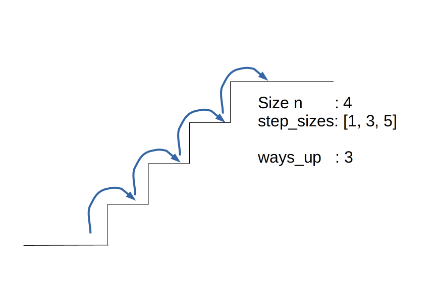

# instructions

Let's get started :rocket: Following these instructions you should be able
to solve this exercise.

## The staircase problem

In this exercise we will look at the staircase problem. This problem is often
used as a coding interview question at companies such as Amazon. Shout out to
[CS Dojo: Recursive Staircase Problem](https://www.youtube.com/watch?v=5o-kdjv7FD0)
on YouTube for the inspiration.

The staircase problem asks for the count of all possible paths up a staircase of
size `n` given a set of possible step sizes. By default, the allowed step sizes
are `[1, 2]`.

For example, a staircase with size `n = 4`, i.e. 4 steps, and `[1, 3, 5]` as
allowed step sizes, has `3` possible ways to get up. Note that the step size
`5` is not used as you are not allowed to overstep the stairs.



## Exercise

Your job is to implement a `ways_up` function that returns the amount of ways
up a staircase with `n` steps and specified step sizes.

Implement this in the `staircase.py` file.

## Example

Here are some example results your function should return

```python
>>> ways_up(1)
1

>>> ways_up(5)
8

>>> ways_up(5, step_sizes=[1, 3, 5])
5
```

## Test

To test your implementation, this exercise comes with a predefined test suite.
To run this test suite, execute the `staircase.test.py` file in this folder
with python3:

```bash
python3 staircase.test.py
```
